## Setup Conductor

Перейти по ссылке [https://developer.orkescloud.com/](https://developer.orkescloud.com/) и авторизоваться.
Создать client_id и client_secret для подключения клиента к Conductor:
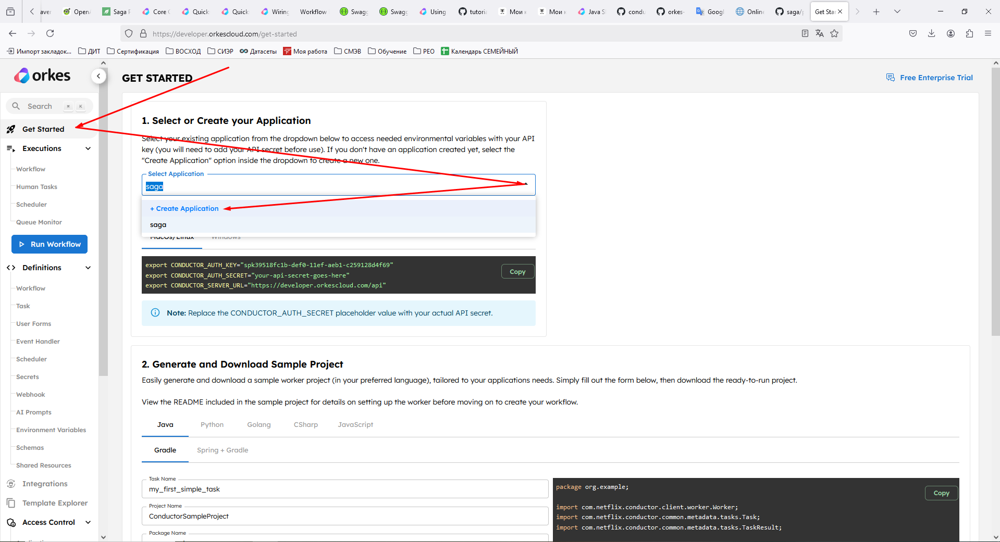
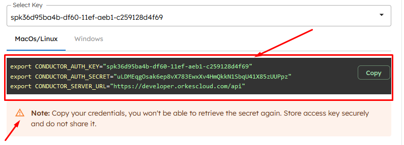
Подставить соответствующие значения в настройки deployment :

```yaml
env:
    -   name: CONDUCTOR_AUTH_KEY
        value: spk39518fc1b-def0-11ef-aeb1-c259128d4f69
    -   name: CONDUCTOR_AUTH_SECRET
        value: qezQQ336JPvw1azvCCfbOyXy6FuCnEKpIEaZotxLPdfcoqkr
```

___

Импортировать task-и:

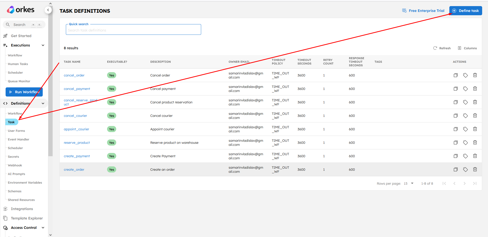

Вставить содержимое файлов из директории [task](./task) и нажать Save:

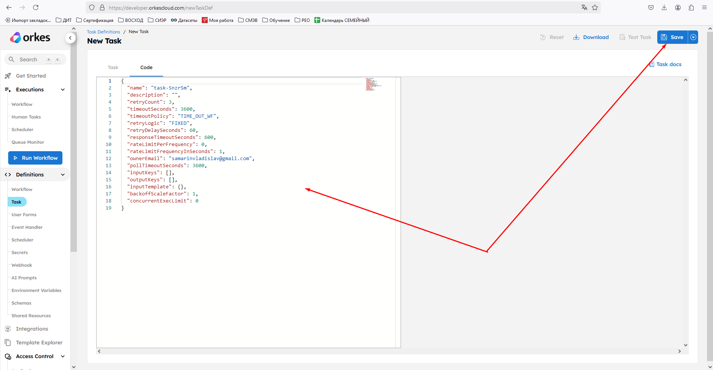

___

Импортировать workflow:
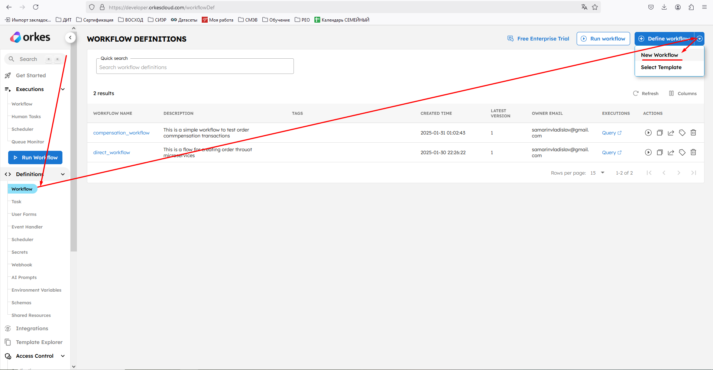
Вставить содержимое файлов _[compensation_workflow.json](./workflow/compensation_workflow.json)_,
_[direct_workflow.json](./workflow/direct_workflow.json)_ и нажать Save:

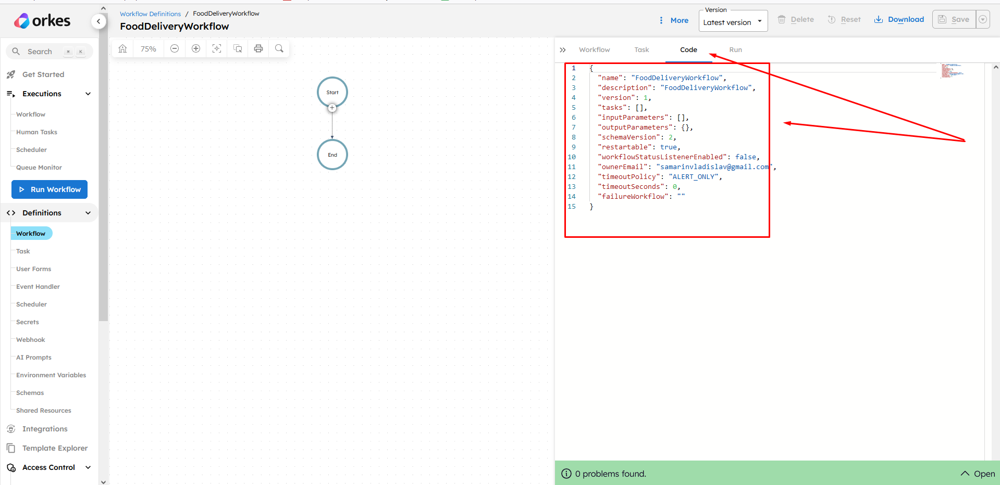

___

Получиться следующий результат:
Direct Flow:
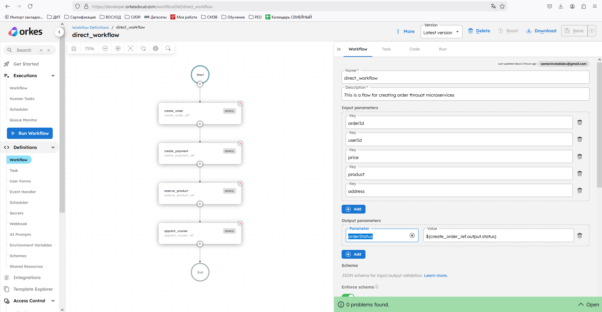
Compensation Flow:
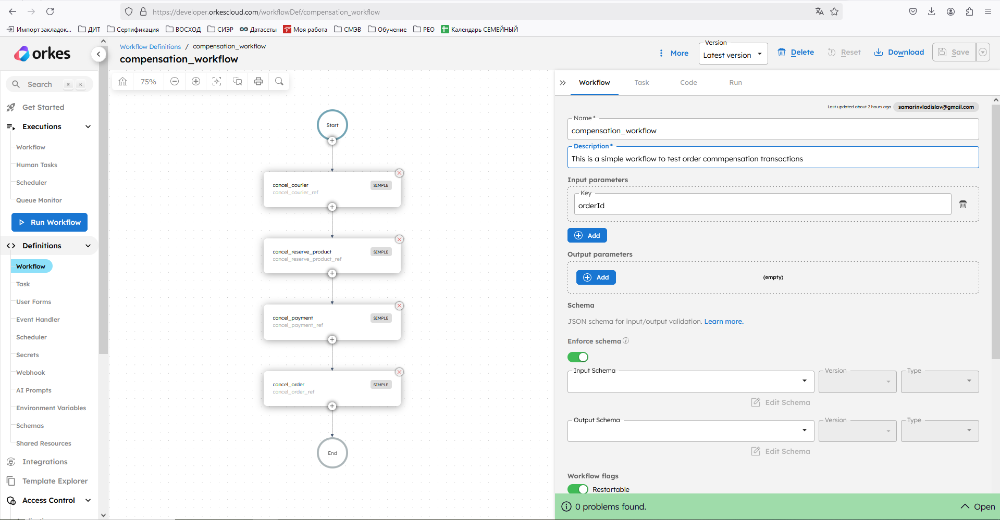

___

Запуск Direct Flow осуществляется вызовом метода сервиса orders /api/v1/workflow:
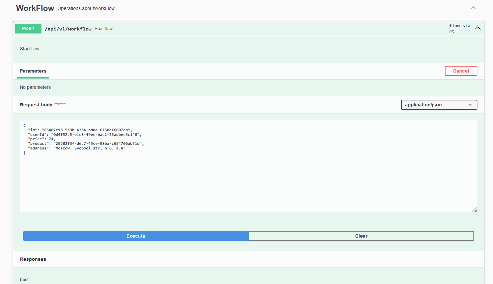
Результаты выполнения отображаются тут:
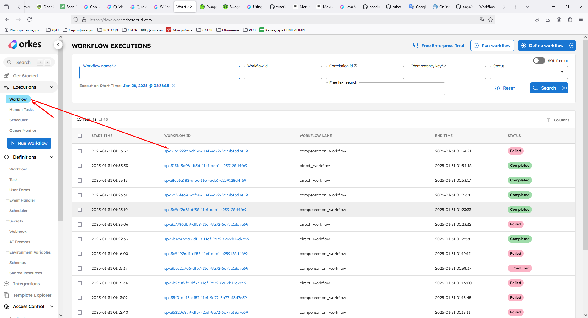
Тут же можно отслеживать параметры с которыми запускались шаги flow:
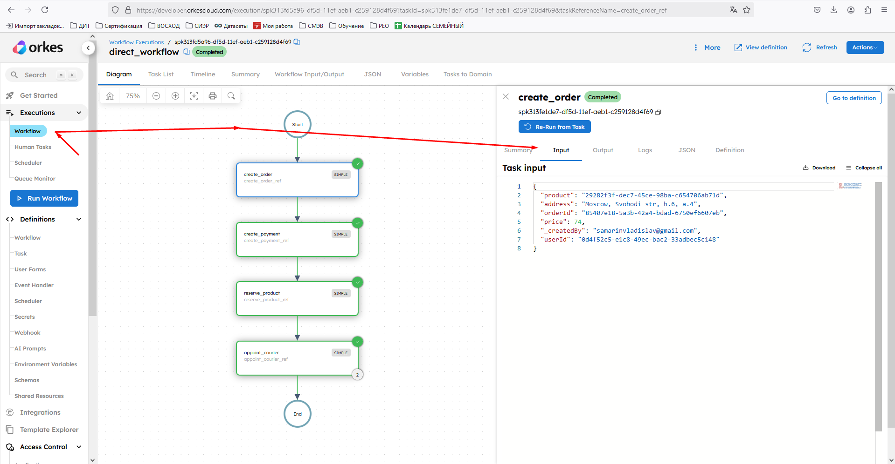
Запуск Compensation Flow осуществляется автоматический worker-ами в случае возникновения ошибки в обработке задачи.
